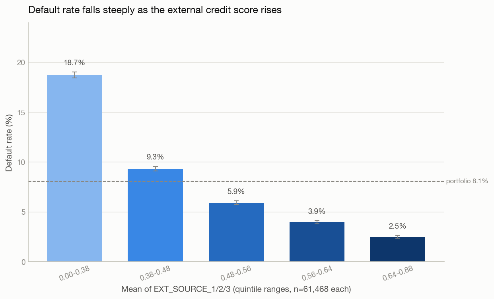
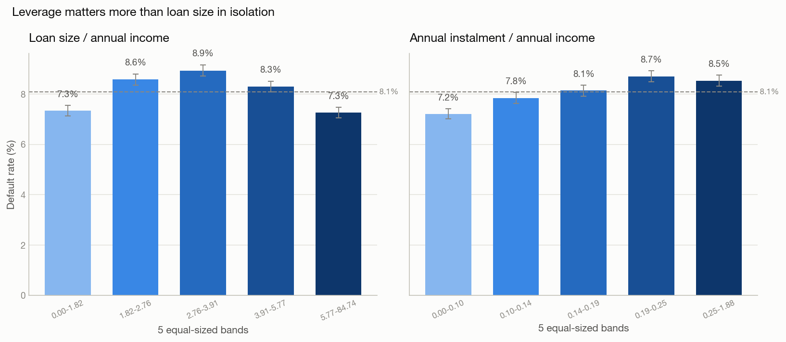
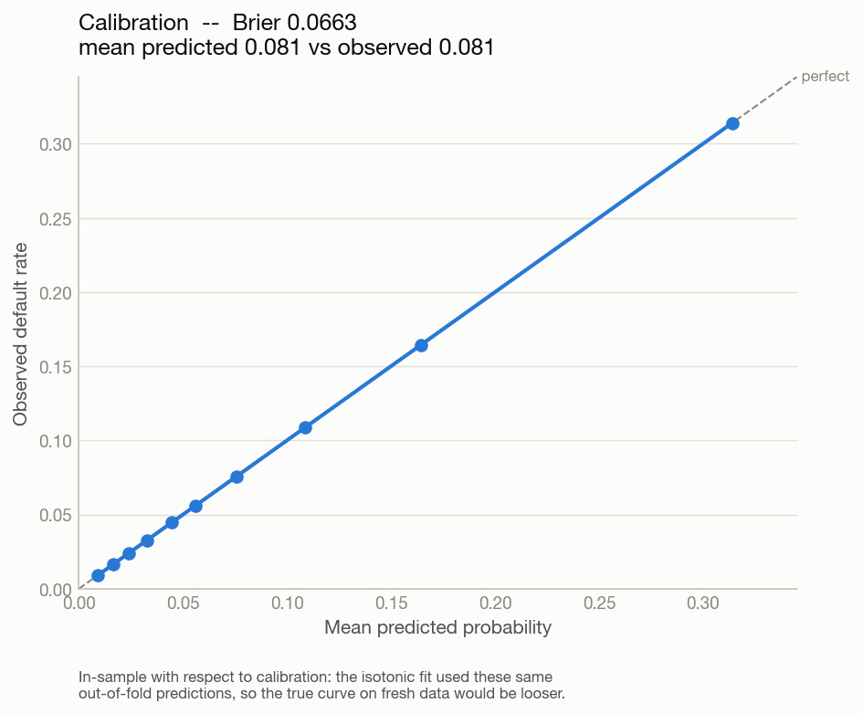
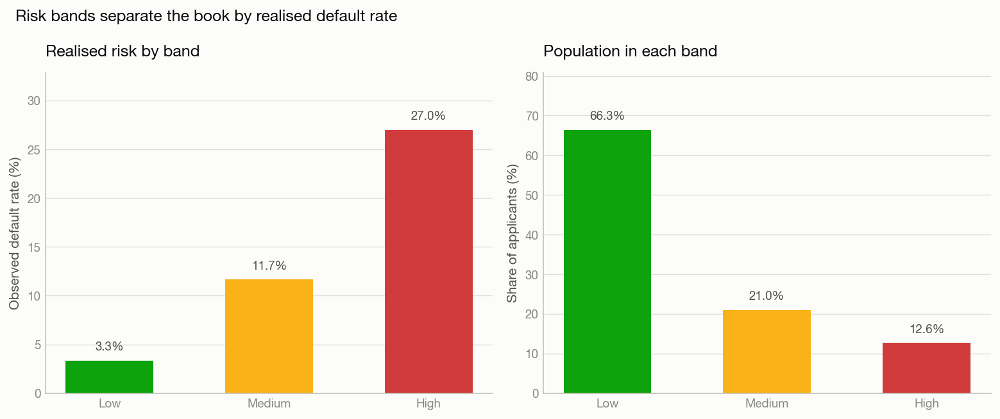
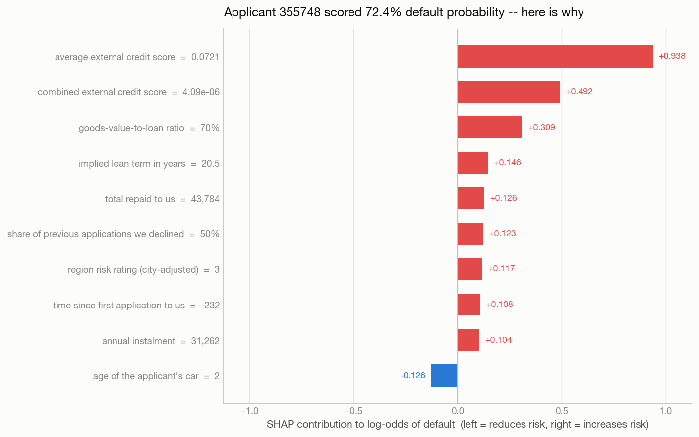

# AI-Powered Credit Risk Intelligence Platform

An end-to-end, explainable credit-risk platform built on the **Home Credit Default
Risk** dataset: exploratory analysis, a calibrated risk model, SHAP explanations,
machine-derived credit policy, and a guarded natural-language interface to the data.

Trained and evaluated on the **full 307,511-row Home Credit dataset**, using four
of its seven tables. Selected model: LightGBM, **ROC-AUC 0.782**, PR-AUC 0.268
(3.3x the no-skill baseline), calibrated to a Brier score of 0.066.

The **trained model ships with the repository**, so a fresh clone scores
applicants with the real 307k-row model immediately — no training step.

**One command runs all of it, with no API key:**

```bash
docker-compose up
```

Then open **http://localhost:8501**.

The language model runs locally in the stack, so the chatbot works out of the box
and applicant records never leave the machine.

---

## Contents

1. [What it does](#1-what-it-does)
2. [Architecture](#2-architecture)
3. [Getting started](#3-getting-started) · [Lightweight deployment](#lightweight-deployment)
4. [Using the real Kaggle data](#4-using-the-real-kaggle-data)
5. [Exploratory analysis](#5-exploratory-analysis)
6. [Model selection and results](#6-model-selection-and-results)
7. [Explainability and derived policy](#7-explainability-and-derived-policy)
8. [Talk to your data](#8-talk-to-your-data)
9. [Prompt engineering and token cost](#9-prompt-engineering-and-token-cost)
10. [Design decisions](#10-design-decisions)
11. [Testing](#11-testing)
12. [Configuration](#12-configuration)
13. [Limitations and next steps](#13-limitations-and-next-steps)
14. [Project layout](#14-project-layout)

---

## 1. What it does

| Capability | Where it lives | What you get |
|---|---|---|
| **Exploratory analysis** | `notebooks/eda.py`, `eda.ipynb` | Portfolio summary, feature catalogue, data-quality findings and 8 business insights, each with a chart and a plain-English takeaway |
| **Risk scoring** | `src/ml/` | A calibrated default probability, a 0–1000 risk score, a risk band and a recommended action |
| **Explainability** | `src/xai/shap_explainer.py` | SHAP contributions per applicant, and a portfolio-level driver ranking |
| **Credit policy** | `src/xai/rules.py` | A surrogate decision tree exported as readable IF/THEN rules, with fidelity reported |
| **Talk to your data** | `src/talk_to_data/` | Plain-English questions answered as validated, read-only SQL |
| **UI** | `src/ui/app.py` | All of the above in one Streamlit app |

---

## 2. Architecture

```
                          ┌──────────────────────────────────────────┐
                          │        Streamlit UI  (port 8501)         │
                          │  Overview · Predict · Explain · Rules ·  │
                          │                 Chat                     │
                          └───┬───────────┬───────────┬──────────────┘
                              │           │           │
            ┌─────────────────┘           │           └────────────────┐
            ▼                             ▼                            ▼
  ┌───────────────────┐        ┌────────────────────┐      ┌──────────────────────┐
  │   ML pipeline     │        │  Explainability    │      │    Talk-to-data      │
  │                   │        │                    │      │                      │
  │ loader            │        │ SHAP               │      │ 1 prompt assembly    │
  │   ↓               │        │  · local           │      │ 2 LLM generates SQL  │
  │ preprocessor      │        │  · global          │      │ 3 SQL VALIDATOR ◄────┼── the
  │   ↓               │        │                    │      │ 4 read-only execute  │   critical
  │ bake-off (3 way)  │        │ Surrogate tree     │      │ 5 grounded summary   │   control
  │   ↓               │        │  → IF/THEN rules   │      │ 6 grounding check    │
  │ calibration       │        │  → fidelity R²     │      │ 7 bounded memory     │
  │   ↓               │        │                    │      │                      │
  │ threshold tuning  │        └─────────┬──────────┘      └───────┬──────────────┘
  │   ↓               │                  │                         │
  │ predict           │◄─────────────────┘                         │
  └─────────┬─────────┘                                            │
            │                                                      │
            ▼                                                      ▼
    ┌───────────────┐                                   ┌──────────────────────┐
    │  models/      │                                   │  PostgreSQL          │
    │  artifacts    │                                   │  4 analytics tables  │
    └───────────────┘                                   │  read-only role      │
            ▲                                           └──────────┬───────────┘
            │                                                      │
    ┌───────┴────────┐                                  ┌──────────┴───────────┐
    │  data/         │                                  │  Ollama (local LLM)  │
    │  CSV source    │                                  │  no API key, no      │
    └────────────────┘                                  │  network egress      │
                                                        └──────────────────────┘
```

**Three containers.** `db` (PostgreSQL 16) holds the analytics tables. `ollama`
runs the language model locally. `app` runs the pipeline and serves the UI. A
one-shot `ollama-pull` service downloads the model on first start.

**Data flow.** CSVs → join + feature engineering → model artifacts → analytics
tables → UI and chat. The chat never touches the model artifacts; it queries the
database, which includes the model's own predictions as a table.

---

## 3. Getting started

### Docker (recommended)

```bash
git clone <repository-url>
cd credit_risk_platform
cp .env.example .env          # optional: the defaults work as-is
docker compose up             # or: docker-compose up
```

> Compose v2 ships as `docker compose`; the hyphenated `docker-compose` works
> too where the v1 shim is installed. Either form is fine throughout this README.

Open **http://localhost:8501**.

**First run takes 5–15 minutes.** It downloads the ~4.7 GB language model, runs
the EDA, trains the three-model bake-off, and loads the database. Subsequent
starts reuse all of it and come up in seconds. Progress is printed to the
compose log; the app is usable as soon as it reports `Starting Streamlit`.

To watch what it is doing:

```bash
docker-compose logs -f app
```

### Local Python

```bash
python3.11 -m venv .venv && source .venv/bin/activate
pip install -r requirements.txt        # add -r requirements-dev.txt for tests/notebook
cp .env.example .env

python -m src.data.generate_sample   # synthetic fixtures
python -m notebooks.eda              # EDA + figures
python -m src.ml.train               # bake-off, calibration, thresholds
python -m src.ml.evaluate            # metrics + curves
python -m src.xai.rules              # credit-policy rules

streamlit run src/ui/app.py
```

Running outside Docker, point the app at your own services:

```bash
POSTGRES_HOST=localhost OLLAMA_BASE_URL=http://localhost:11434 streamlit run src/ui/app.py
```

Or skip PostgreSQL entirely with `USE_SQLITE_FALLBACK=true`. Everything except
production-grade concurrency works the same.

---

### Lightweight deployment

The full stack bundles a local language model, which is what makes the chatbot
work with no API key — but it is 4.2GB of image plus a 4.7GB model, and needs
that resident in RAM. That does not fit a small cloud instance.

For deployment there is a second profile:

```bash
docker compose -f docker-compose.lite.yml up
```

| | Full stack | Lite stack |
|---|---|---|
| Services | app + PostgreSQL + Ollama | app + PostgreSQL |
| Images on disk | **10.43 GB** | **1.83 GB** |
| RAM at rest | ~6 GB (model resident) | **267 MB** |
| Chat | Local model, no API key | Hosted provider, or disabled |
| Everything else | Works | Works, identically |

The lite profile serves the **committed pre-trained model**, so scoring, SHAP
explanations, the policy rules and the audit trail are all immediate — there is
no training step at start-up. Only the chat needs a decision: set
`LLM_PROVIDER` and a key for a hosted provider, or leave it and the Chat tab
reports itself unavailable while every other section carries on.

There is also `requirements-serve.txt`, a minimal install (~300MB smaller) that
omits CatBoost — a training-time dependency the shipped LightGBM model does not
need — for platforms where you install packages rather than run a container.

## 4. Using the real Kaggle data

The Home Credit CSVs are Kaggle-gated and far too large to commit, so **`data/`
is gitignored and nothing in it is ever committed.**

The repository instead ships **synthetic fixtures** in `data/sample/` that are
schema-identical to the real files:

* `application_train.csv` — all **122** real columns, plus `TARGET`
* `application_test.csv` — the same 121 columns without the label
* `bureau.csv` — all **17** real columns

They reproduce the properties the pipeline has to cope with: an ~8.5% default
rate, the `DAYS_EMPLOYED = 365243` sentinel attached to pensioners, real
per-column missingness (`EXT_SOURCE_1` ~56% null, `OCCUPATION_TYPE` ~31%),
applicants with no bureau history, and genuine non-linear signal.

To use the real data:

```bash
# Place application_train.csv, application_test.csv and bureau.csv in ./data/
echo "DATA_MODE=real" >> .env
docker-compose up
```

No code changes. `DATA_MODE` is the only switch, and every module reads the same
path resolver.

---

## 5. Exploratory analysis

`notebooks/eda.ipynb` presents the analysis; `notebooks/eda.py` implements it.
The notebook imports the module rather than duplicating it, so the notebook, the
saved figures, this README and the UI can never disagree.

```bash
python -m notebooks.eda          # writes reports/figures/ and reports/*.json
```

**Delivered:** dataset summary, feature categorization (by storage type and by
business domain), a data-quality report with per-column missingness, and **8
business insights**.

Every segment rate carries a **95% Wilson confidence interval**, drawn as error
bars. Where intervals overlap, the written takeaway says so instead of asserting
a difference — the education spread, for instance, self-reports as directional
only because its worst band holds just 50 applicants.

Findings on the **real 307,511-row dataset** (9 insights; 6 shown):

| Insight | Finding |
|---|---|
| External scores dominate | Default rate falls **18.7% → 2.5%** across score quintiles, monotonically |
| **Loan size does *not* separate risk** | Loan-to-income is an inverted U — **7.3% at both extremes**, peaking at 8.9% in the middle. The *instalment* ratio does rise monotonically (7.2% → 8.7%) |
| Prior repayment behaviour | Applicants who ever paid one of our instalments late default at **9.4%** vs 6.8% |
| Prior arrears elsewhere | **15.9%** with bureau arrears vs 7.6% without — 2.1×, non-overlapping intervals |
| The employment anomaly is a population | 18% carry the 365243 sentinel; they are pensioners, and they default *less* (5.4% vs 8.7%) |
| Education spreads risk | **1.8%** (Academic degree) to **10.9%** (Lower secondary) |



*The strongest single signal, and monotonic across every band — which is what
makes it usable for policy. Error bars are 95% Wilson intervals.*



*Loan-to-income (left) is an inverted U: both extremes are lower-risk than the
middle. Instalment-to-income (right) rises consistently. Only the second is a
usable affordability constraint.*

The loan-to-income finding is the one worth dwelling on, because it contradicts
the obvious assumption. The most heavily leveraged applicants are **not** the
riskiest — most likely because very high loan-to-income ratios pick up secured
and longer-term products rather than distressed borrowing. An earlier version of
this README asserted the opposite, because the insight's takeaway was written by
hand. It now derives its claim from the data by rank correlation, and reaches
opposite conclusions on the real and synthetic datasets — correctly in both cases.

---

## 6. Model selection and results

### The bake-off

Three candidates, identical features, identical stratified 5-fold CV.
"Identical features" means the same feature *set*, encoded appropriately per
family: the trees consume NaN and categoricals natively, while the linear
baseline gets median imputation, one-hot encoding and standardisation **inside
its own pipeline, refitted on every fold** so nothing leaks across the split.

Five-fold, out-of-fold, on all 307,511 rows and 198 engineered features:

| Model | PR-AUC | ± s.e. | ROC-AUC | Brier | Fit (s) | Exact tree SHAP |
|---|---|---|---|---|---|---|
| **LightGBM (selected)** | **0.2720** | 0.0033 | 0.7811 | 0.1711 | 34 | Yes |
| CatBoost | 0.2705 | 0.0039 | 0.7809 | 0.1801 | 212 | Yes |
| Logistic regression | 0.2480 | 0.0026 | 0.7666 | 0.1961 | 39 | No |

Hyperparameters come from a randomised search over 12 settings per model, scored
on average precision — the same metric the bake-off selects on, because tuning
for one objective and selecting on another yields a model that looks better and
performs worse. All three were tuned; tuning one and comparing it against
another's defaults is not a comparison. The searched values are baked in as the
defaults, so the shipped model is the tuned one and `--tune` reproduces it.

### Why LightGBM

LightGBM and CatBoost are **statistically tied**: 0.2720 against 0.2705, a gap
of 0.0015 against standard errors of 0.0033 and 0.0039. `select_winner()`
encodes that explicitly — any candidate within one standard error of the leader
is treated as tied, and the tie is decided on the brief's secondary criteria:
exact tree SHAP support first, then fit cost. Both support SHAP, so it came down
to cost, and LightGBM delivers the same performance in **a sixth of the training
time** (34s against 212s).

Logistic regression is genuinely behind here (0.2480), and that is worth
recording because **it was not true on the synthetic fixture**. There, a largely
linear data-generating process flattered the linear model into first place. On
real data the boosted models win by 0.024 PR-AUC — a gap roughly seven standard
errors wide. The selection logic did not change; the data did.

**The bake-off was wrong twice before it was right**, and both bugs are worth
recording:
  1. LightGBM was silently stopping at **iteration 5**. LightGBM tracks its
     objective's default metric alongside the requested one and halts when *any*
     of them stalls; under `scale_pos_weight` the unweighted logloss degrades
     immediately. Fixed with `metric="average_precision"` and
     `first_metric_only=True` — worth **0.07 PR-AUC**.
  2. The fixture's data-generating process was **linear in the logit**, making
     logistic regression the correctly specified model by construction. Adding
     the non-linearities real credit data has (leverage compounding with a weak
     score, a scorecard cliff, U-shaped age risk) made the comparison meaningful
     — and the real data then confirmed the direction.

### Which tables earn their place

Four of the seven Kaggle tables are used. That is a measured decision, not a
guess: `src/ml/ablation.py` switches each block on in turn and reports the gain.

| Configuration | Features | PR-AUC | ROC-AUC | Marginal gain |
|---|---|---|---|---|
| `application` only | 139 | 0.2507 | 0.7660 | — |
| `+ bureau` | 166 | 0.2576 | 0.7697 | **+0.0069** |
| `+ previous_application` | 183 | 0.2638 | 0.7747 | **+0.0062** |
| `+ installments_payments` | 198 | 0.2708 | 0.7800 | **+0.0070** |

Each block contributes roughly equally, so all three stay. `bureau_balance`,
`POS_CASH_balance` and `credit_card_balance` are excluded: each is a monthly
panel largely redundant with these aggregates, and each costs real runtime.
Nothing is included merely because it exists.

`installments_payments` matters beyond its AUC contribution. It is the table
that actually contains **repayment behaviour** — payment date against due date,
amount paid against amount owed — which the brief names as an analysis area and
which no other table captures.

### Class imbalance: weighting, not SMOTE

The default rate is ~8.5%, an 11:1 imbalance. The model uses
`scale_pos_weight` / `class_weight="balanced"`.

**SMOTE is deliberately not used.** It fabricates minority-class rows by
interpolating between neighbours, which changes the class prior the model sees
and pushes predicted probabilities upward. This platform's product *is* a
calibrated probability — "0.20 means one in five of these applicants default" —
so a technique that biases probabilities upward is disqualifying regardless of
what it does to AUC. Interpolating between two applicants also invents people
who do not exist, in a domain with legal explainability requirements.

### Calibration

Boosted models trained with `scale_pos_weight` rank well but are badly *scaled* —
the weighting deliberately inflates scores away from the true prior. An isotonic
calibrator fitted on out-of-fold predictions corrects that:

| | Brier | Mean predicted | Observed |
|---|---|---|---|
| Before | 0.1711 | — | 0.0807 |
| **After** | **0.0663** | **0.0807** | 0.0807 |



**Caveat, stated on the chart itself:** the calibrator was fitted on the same
out-of-fold predictions the reliability curve is drawn from, so that curve is
in-sample with respect to calibration and looks better than it would on fresh
data. The ranking metrics are genuinely out-of-fold; the calibration fit is not.

### Thresholds and risk bands — never 0.5

At an 8.5% base rate a 0.5 cut-off approves nearly everyone. Both the decision
point and the band edges are tuned on out-of-fold predictions.

| | Tuned (0.165) | Naive (0.5) |
|---|---|---|
| Precision | 0.267 | 0.604 |
| Recall | 0.430 | 0.029 |
| Share of book flagged | 13.0% | 0.4% |
| **Defaults caught** | **10,665** | 713 |
| Defaults missed | 14,160 | 24,112 |

The tuned threshold catches **15× more defaults**. The naive cut-off looks more
precise only because it flags almost nobody — it finds 3% of the defaults in the
book, which is not a usable credit policy.

Bands are defined so the *marginal* applicant is bounded, not the group average:

| Band | Definition | Population | Realised default rate | Share of all defaults |
|---|---|---|---|---|
| **Low** | ≤ portfolio base rate (0.081) | 66.3% | **3.34%** | 27% |
| **Medium** | ≤ decision threshold (0.165) | 21.0% | 11.65% | 30% |
| **High** | above it → refer for review | 12.6% | **26.96%** | **42%** |

The High band is an eighth of the book and contains two-fifths of the defaults.



An earlier version set the Low edge wherever the *average* rate below it met a
5% target. Reading the generated policy rules exposed the flaw: a rule
predicting 12.9% default was being labelled "Low", because averaging over a wide
band hid its own upper end. Band edges must bound the marginal applicant.

---

## 7. Explainability and derived policy

Two explanations for two audiences, from one pipeline.

**SHAP — why *this* applicant.** Signed per-feature contributions, rendered as a
diverging chart, a ranked table, and — the part that matters for a decision
someone has to justify — a plain-English paragraph:

> This applicant has a 87.5% estimated probability of default, placing them in
> the **High** risk band. Recommended action: refer for review. The main factors
> increasing risk are that their average external credit score of 0.171 raises
> the risk, their combined external credit score of 3.25e-05 raises the risk,
> and their share of instalments paid late of 48% raises the risk.

A ranked table of log-odds is an explanation for a modeller. An applicant who
has been referred is entitled to something they can act on, and a credit officer
needs to be able to say the reason out loud. Both explanation surfaces — SHAP
and the policy rules — draw their vocabulary from one shared module
(`src/xai/feature_labels.py`), so `BUREAU_DEBT_CREDIT_RATIO = 0.59` is always
rendered as "share of external credit still unpaid = 59%" and the two can never
describe the same feature differently. Raw SHAP values remain available in the
table for anyone who wants them.



*One applicant's contributions, in plain English rather than raw column names.
Blue reduces risk, red increases it.*

The explainer dispatches on model family: CatBoost's native exact `ShapValues`,
LightGBM's `TreeExplainer`, or exact linear Shapley values for the logistic
pipeline.

**No prediction claims certainty.** Isotonic calibration returns exactly 0 and 1
wherever a calibration bin was pure, which produced explanations asserting a
"100.0% probability of default" — not something a lender could defend from a
finite sample. Calibrated probabilities are bounded to [0.001, 0.999] wherever
they are consumed, so the bands, the metrics and what an applicant is told all
describe the same numbers.

**Surrogate tree — what policy the model applies.** A depth-4 decision tree is
fitted against **the model's own calibrated predictions** — not against the
labels, because the goal is to describe what the model does, including where it
is wrong. Its leaves export as credit-policy rules:

```
RULE 1  --  covers 1,930 applicants (3.9% of the book)
  IF   average external credit score <= 0.395
  AND  combined external credit score <= 0.023
  AND  average external credit score <= 0.247
  THEN predicted default risk 31.2%  ->  High risk band
       observed default rate in this group: 30.7%
```

Sample of the exported rules table, from the real data (full set in
`reports/policy_rules.csv` — 13 rules over a depth-4 tree fitted to 50,000
scored applicants):

| Rule | Conditions | Predicted | Observed | Coverage | Band |
|---|---|---|---|---|---|
| 1 | avg external score ≤ 0.395 AND combined score ≤ 0.023 AND avg score ≤ 0.247 | 31.2% | **30.7%** | 3.9% | High |
| 2 | avg external score ≤ 0.395 AND combined score ≤ 0.023 AND avg score > 0.247 | 20.8% | **20.2%** | 3.4% | High |
| 3 | avg external score ≤ 0.395 AND combined score > 0.023 AND goods-to-loan ≤ 0.826 | 20.6% | **19.4%** | 3.4% | High |

Predicted and observed agree to within about a percentage point on every leaf,
which is the evidence that a rule means what it claims.

**Fidelity is reported with every rule set** — R² 0.556, band agreement 73.1% —
because a surrogate that does not track the model is worse than no surrogate: it
looks authoritative while being wrong. R² 0.556 is a real limitation stated
plainly: roughly one applicant in four would be banded differently by the rules
than by the model. The rules describe the policy the model implies; they do not
replace it.

---

## 8. Talk to your data

Ask in English; get an answer, the SQL behind it, and the rows.

> **"Which education level has the highest default rate?"**
> The highest default rate is for Lower secondary with a rate of 16%.

An LLM writes the SQL, so **the SQL is untrusted input**. Three independent
layers make that acceptable, and each was tested by attacking it.

### Verified query patterns

Eight patterns, each covering a distinct *shape* of question. Every row below was
run end-to-end against the PostgreSQL stack with the local model, in one
conversation so later turns carried memory pressure:

| # | Pattern | Question | Answer returned |
|---|---|---|---|
| 1 | Rate overall | "What is the overall default rate?" | 8.53% across 4,000 applicants |
| 2 | Rate by segment | "Which education level has the highest default rate?" | Lower secondary, 16% |
| 3 | Two-group comparison | "Compare average income between applicants who defaulted and those who repaid." | Repaid 177,000 vs defaulted 165,000 |
| 4 | Banding a continuous column | "How does the default rate vary across external credit score bands?" | 30.12% → 13.62% → 5.61% → 0.97% |
| 5 | Join to bureau | "Do applicants with prior arrears default more often?" | 13.28% with arrears vs 7.69% without |
| 6 | Join to model output | "What does the model's risk banding look like, and is it accurate?" | Low 2.57% predicted / 2.57% actual, and so on per band |
| 7 | Row-level ranking | "Show me the 5 riskiest applicants the model flagged for review." | Top 5 by risk score, with their loan and income |
| 8 | Unanswerable | "What is the average credit card balance?" | Declines, naming the absent column |

**Result: 8/8 handled correctly.**

### Layer 1 — the SQL validator (`sql_validator.py`)

Fails closed at every step. A wrongly rejected safe query is always better than
an executed unsafe one.

| Check | Rejects |
|---|---|
| Single statement | `SELECT 1; DROP TABLE applications` |
| Structural | Anything whose root is not a `SELECT` |
| Node blacklist | Any write/DDL node **anywhere** in the tree — including a `DELETE` hidden inside a CTE |
| Function blacklist | `pg_read_file`, `pg_sleep`, `lo_import`, `dblink`, … |
| **Table whitelist** | `SELECT * FROM customers` — checked against the **live** schema |
| **Column whitelist** | `SELECT credit_score FROM applications` — the anti-hallucination check |
| Row cap | Injects or tightens `LIMIT` |

The statement that runs is **re-serialised from the parse tree**, never the
model's string, so anything the parser did not represent cannot survive. Comments
are the exception worth naming — sqlglot *retains* them on nodes and re-emits
them, so they are stripped explicitly rather than assumed away.

Result: **33 attacks attempted, 0 leaks, 0 false rejections** on legitimate
queries. The attack set covers stacked statements, comment-hidden statements,
writes buried in CTEs, system-catalog and `information_schema` access, UNION
exfiltration, schema-qualified dangerous functions, case-mangled DDL, `COPY TO`,
`SET ROLE`, and hallucinated tables and columns.

One finding worth recording: a CTE that *shadows* a real table name
(`WITH applications AS (...)`) turned out **not** to be an escape — the CTE body
is still fully validated, so a shadowed name cannot smuggle in a catalog table,
an unknown column or a write. It is rejected anyway, because it makes a
statement mean something other than what it appears to say and no legitimate
generated query needs it. This layer fails closed by policy, not only where
exploitability is proven.

### Deterministic repair: where prompting was not enough

PostgreSQL has no `ROUND(double precision, integer)` — it exists only for
`numeric` — so rounding an average of a FLOAT column fails at execution even
though the statement is perfectly valid to the parser.

The instruction was added to the system prompt *and* demonstrated in a worked
example, and the model still reverted to the uncast form once the conversation
carried a few turns of history. A prompt instruction is advisory; the model is
free to ignore it, and under context pressure it did.

The validator now rewrites `ROUND(x, n)` to `ROUND(CAST(x AS NUMERIC), n)`
during the re-serialisation it already performs. The cast is applied
unconditionally, because casting an integer expression to numeric is a no-op on
both backends, so no type inference is needed. **That is the general lesson: if
a failure mode is deterministic, fix it deterministically rather than asking the
model more firmly.** Before the rewrite this question failed even after two
repair attempts; after it, the same conversation answers 8/8.

### Layer 2 — a read-only database role

Created by `docker/init-readonly.sh` on first start, with `ALTER DEFAULT
PRIVILEGES FOR ROLE` so it covers tables created later. Verified live:

```
credit_readonly=> SELECT COUNT(*) FROM applications;   →  4000
credit_readonly=> DELETE FROM applications;            →  ERROR: permission denied
credit_readonly=> DROP TABLE predictions;              →  ERROR: must be owner
```

A statement timeout is set on the role itself, so a valid-but-pathological query
cannot hold a connection open.

### Layer 3 — numeric grounding verification

The most dangerous failure is not bad SQL — it is a **fluent summary containing
an invented number**, because it looks exactly like a correct answer and the SQL
validator cannot catch it (the query was perfectly valid).

Every figure quoted in a generated summary must occur in the returned rows.
This came directly from an observed failure — a local model answered:

> "…approximately 0.08% of the total sample size (2,854 + 50 + 153 + 942 = 3,999)."

Every input was real; the arithmetic and the conclusion were invented. Both
fabricated figures are caught, the summary is discarded, and a truthful
deterministic description is shown instead with a visible note.

The check also rejects a summary that claims an empty result over a non-empty
one — a contradiction that quotes no numbers at all — and accepts numbers
embedded in category labels such as `"1. Very low (<0.3)"`, which an earlier
version wrongly flagged.

### Layer 0 — refusal

The model is instructed to answer `CANNOT_ANSWER: <reason>` when a question
cannot be answered from the schema, and that refusal is **believed** rather than
retried. An admitted gap beats an invented column:

> **"What is the average credit card balance?"**
> I can't answer that from the available data. There is no column in the schema
> that represents a credit card balance.

### A note on the `predictions` table

It holds **out-of-fold** predictions, not the final model's scores on its own
training data. That distinction changes the answer to a question users actually
ask. Scored in-sample, the Low band showed a 0.13% actual default rate against
2.55% predicted — which measures overfitting, not calibration. With out-of-fold
predictions the same query returns 2.57% predicted against 2.57% actual.

That exact agreement is itself a consequence of the calibration caveat noted
above: the isotonic calibrator was fitted on these same out-of-fold predictions,
so binned means agree by construction. It is the honest number available without
a held-out set, and it is worth knowing why it looks as clean as it does.

### Conversation memory

Follow-ups need history ("and for women?"), but history is re-sent every turn, so
it is bounded: the last 6 turns only, stored as **compact summaries** — question,
SQL, result shape — never the returned rows. Failed turns are retained and marked
so the model learns from a rejection instead of repeating it.

### Acceptance run

8/8 questions handled correctly against `qwen2.5-coder:7b`, covering rate-by-
segment, two-group comparison, banding, joins to model output, bureau joins,
row-level ranking, and the refusal case.

---

## 9. Prompt engineering and token cost

Templates are **versioned** (`PROMPT_VERSION`, currently 1.4.0) so a prompt
change is a reviewable, revertable event.

**Token budget: ~1,700 per turn**, with a documented lever down to ~1,160.

| Technique | Why |
|---|---|
| **Curated schema, not a dump** | The description covers 4 narrow tables (~700 tokens). The raw 122-column application table alone would be several thousand — and every extra column widens the space of plausible-but-wrong names |
| **Engineered columns materialised** | `age_years` and `ext_source_mean` exist as real columns, so "average age of defaulters" maps directly instead of requiring invented arithmetic |
| **Few-shot over instructions** | Prose rules are followed inconsistently; a worked example showing `AVG(target) * 100` is imitated reliably. 8 examples, each teaching a distinct *question shape* |
| **Compact history** | Turn summaries, not result rows |
| **`few_shot_limit`** | Runtime lever to trade accuracy for tokens |

### Choosing the model size: measured, not assumed

A smaller model would make the stack far lighter, so it was tested rather than
guessed at. Both were run over the same questions against the real database:

| | qwen2.5-coder:1.5b | qwen2.5-coder:7b |
|---|---|---|
| Size | 986 MB | 4.7 GB |
| Average latency | **4.8s** | 13.1s |
| "Which education level has the highest default rate?" | ❌ said Secondary, 8.94% — the rows show Lower secondary at 10.93% | ✅ correct |
| "What share have no external credit history?" | ❌ 85.69% — that is the share *with* history, inverted | ✅ correct |
| "What is the average credit card balance?" | ❌ **fabricated 599,026** for a column that does not exist | ✅ refused |

The 1.5B model is 2.7x faster and confidently wrong, so **the 7B is the
default**. It is available as `LLM_MODEL=qwen2.5-coder:1.5b` for anyone who
needs the smaller footprint and accepts that trade.

Worth recording how nearly this went the other way: an initial pass scored both
models 6/6 and looked like a clear win for the small one. That metric counted a
question as passed if the pipeline *succeeded or refused* — not if the answer
was **right**. Reading the actual answers reversed the conclusion. The
grounding checks caught three of the 1.5B model's fabrications, which is the
control working, but a control that fires constantly is a signal to change the
model, not to trust the control.

Two rules were added in response to *observed* failures, not speculation:

* **Read extremes off the rows.** The model called Secondary "highest" at 8.83%
  when Lower secondary showed 16.00%, substituting the larger group.
* **Report what, never why.** It appended causal claims ("because it has the
  largest number of applicants (50)") that were factually backwards.

---

## 10. Design decisions

**Deviation from the suggested stack: a local LLM instead of a hosted API.**
This is the one place the project departs from the obvious choice, so it is
worth stating plainly rather than leaving to be inferred.

| | Hosted API (OpenAI / Anthropic / Gemini) | Local Ollama (chosen) |
|---|---|---|
| Applicant data | Leaves the host | Never leaves the host |
| Evaluator setup | Needs a key, an account, billing | None |
| Runs offline | No | Yes |
| Cost per question | Metered | Zero |
| Answer quality | Higher | Sufficient — 8/8 patterns |
| Latency | ~2s | ~15–30s on CPU |

The trade is latency and some answer quality for **data residency and zero
setup friction**, which for a credit-risk system handling personal financial
records is the right way round. Nothing is lost by the choice: all four
providers sit behind one interface, so `LLM_PROVIDER=openai` with a key
switches to a hosted model without a code change, and every hallucination
control applies identically whichever is selected.

**Local LLM by default.** Talk-to-data sends schema context and query results —
derived from real applicant records — to a model. Running it on-box means that
data never leaves the host, which is the right posture for a credit system, and
it means `docker-compose up` yields a working chatbot with no key, no billing
account and no signup. Hosted providers remain available behind the same
interface via `LLM_PROVIDER`.

**Four of the seven tables, chosen by measurement.** `application`, `bureau`,
`previous_application` and `installments_payments`. Each was switched on in turn
and its contribution measured (see the ablation above); each adds roughly
+0.007 PR-AUC, so each stays. The three monthly panels are excluded because they
are largely redundant with these aggregates and cost real runtime — not because
seven tables felt like too many.

An earlier version of this project used only `application` and `bureau`, and
justified it as a signal/explainability trade. That was wrong in one specific
way: `installments_payments` is the table that contains **repayment behaviour**,
which the brief names as an analysis area, and no other table substitutes for
it. The lesson generalises — a scope decision defended on principle should still
be checked against a measurement.

**Missingness is kept, not imputed.** For tree models an absent value is a usable
branch, and in credit data absence is informative — a thin bureau file and an
undisclosed occupation are both risk signals. Only the linear baseline imputes,
inside its own CV fold. Thin-file applicants keep their NULLs plus an explicit
`BUREAU_HAS_HISTORY` flag.

**Ratios, not raw amounts.** A 500k loan is routine on a 300k income and reckless
on a 60k one. Credit-to-income, annuity-to-income and payment rate express
leverage directly — and are what a credit officer already reasons about, so the
model's explanations land in familiar language.

**PR-AUC leads.** At an 8.5% positive rate, ROC-AUC is flattered by the large
negative class and accuracy is actively misleading. Reports always show the
no-skill PR-AUC baseline (the base rate) beside the score, so 0.31 is not read
as "bad" without context — it is **3.6× the no-skill baseline**.

**Charts are validated, not eyeballed.** The palette passes a colour-vision
validator (categorical pair CVD ΔE 24.7 against a floor of 8; ordinal ramp
monotone in OKLab lightness with every adjacent gap ≥ 0.06). The ordinal ramp is
**capped at 5 bands** because exhaustive search showed the documented steps
cannot separate 6. No chart uses two y-axes: "volume and rate" is drawn as two
panels sharing an x-axis, because aligning two scales invents a correlation that
is not in the data.

---

## 11. Testing

```bash
pytest -q          # 300 tests
```

The whole suite runs with **no Kaggle data, no PostgreSQL server, no model
runtime and no API key** — SQLite and a scripted LLM stand in, so CI needs
nothing but Python.

| Area | Focus |
|---|---|
| `test_sql_validator.py` | 51 tests, mostly adversarial — every one asserts something unsafe is refused |
| `test_talk_to_data.py` | End-to-end query patterns, grounding checks, memory bounds, repair loop |
| `test_train.py` | Selection logic, calibration, threshold tuning |
| `test_xai.py` | Surrogate fidelity; rules must track the model |
| `test_ui.py` | Every Streamlit section renders — using Streamlit's `AppTest`, because a live server returns HTTP 200 even when every section is raising |

Several tests are regression guards for bugs found during development, each
documented in place: the negative-days rule that silently deleted the anomaly
flag, LightGBM's early-stopping metric, the grounding false positive on banded
labels, and the `st.image` keyword that broke every UI section behind a 200.

---

## 12. Configuration

Everything is environment-driven; nothing is hardcoded. See **`.env.example`**
for the complete annotated list. The defaults work with no edits.

| Variable | Default | Purpose |
|---|---|---|
| `DATA_MODE` | `sample` | `sample` fixtures or `real` Kaggle CSVs |
| `LLM_PROVIDER` | `ollama` | `ollama` (local, no key) / `openai` / `anthropic` / `gemini` / `none` |
| `LLM_MODEL` | `qwen2.5-coder:7b` | Chosen for text-to-SQL accuracy at 7B |
| `OLLAMA_FALLBACK_MODEL` | `llama3.1:8b` | Used if the preferred model cannot be pulled |
| `SQL_MAX_ROWS` | `200` | Hard `LIMIT` injected into every generated query |
| `SQL_TIMEOUT_SECONDS` | `15` | Server-side statement timeout |
| `MEMORY_MAX_TURNS` | `6` | Conversation turns retained |
| `CALIBRATION_METHOD` | `isotonic` | `isotonic` or `sigmoid` |
| `RISK_BAND_*` | — | Band edge targets |
| `USE_SQLITE_FALLBACK` | `false` | Run without PostgreSQL |

Selecting a hosted provider without its key never crashes the app: the Chat tab
explains what is missing and how to fix it, and every other feature keeps working.

---

## 13. Limitations and next steps

**Known limitations**

1. **Calibration is measured in-sample.** The isotonic fit uses the same
   out-of-fold predictions the reliability curve is drawn from. A held-out
   calibration set would measure it honestly.
2. **The shipped model is trained on the real data; the committed fixtures are
   not the real data.** Every metric in this README comes from the full
   307,511-row dataset. The synthetic fixtures exist so the pipeline runs
   without a Kaggle download, and they are schema-faithful, but their absolute
   numbers differ and their model ranking differs (logistic wins on the fixture,
   LightGBM on the real data). Which dataset produced a figure is stated
   wherever a figure appears.
3. **Four of seven tables are used.** The three monthly panels
   (`bureau_balance`, `POS_CASH_balance`, `credit_card_balance`) were excluded
   as redundant, but that judgement was made on structure rather than measured
   the way the other three were.
4. **Small-model summaries need the guard.** A 3B model produced ungrounded
   summaries often enough that the grounding check fires regularly; 7B is
   noticeably better. The guard makes a weak model safe, not accurate.
5. **The surrogate is an approximation.** R² 0.556 and 73.1% band agreement mean
   roughly one applicant in four would be banded differently by the rules than
   by the model. The rules describe policy; they do not replace the model.
   Fidelity is lower on the real data than on the fixture, which is expected: a
   depth-4 tree has less to work with when the underlying relationships are
   messier.
6. **No fairness audit.** Several features (gender, family status) are legally
   sensitive in lending. They are used here because the dataset includes them,
   but a production system needs disparate-impact testing before deployment.
7. **Single-node deployment.** No authentication, no rate limiting, no
   horizontal scaling.

**Next steps, roughly in value order**

1. A held-out calibration split, and calibration drift monitoring.
2. Fairness metrics per protected attribute, with reject-option post-processing.
3. `previous_application` and `installments_payments` aggregates, measured for
   whether the added opacity earns its AUC.
4. Prompt-accuracy evaluation: a labelled question→SQL set scored automatically
   on every prompt change, turning prompt edits into a measurable experiment.
5. Model monitoring — PSI on feature distributions, alerting on score drift.
6. Authentication and per-user query audit logging for the chat.

---

## 14. Project layout

```
credit_risk_platform/
├── data/                          # gitignored; real CSVs mounted here
│   └── sample/                    # committed synthetic fixtures
├── documents/                     # presentation (PDF) for submission
├── notebooks/
│   ├── eda.ipynb                  # presentation layer
│   └── eda.py                     # the implementation, importable
├── src/
│   ├── data/                      # loader, preprocessor, db loader, fixtures
│   ├── ml/                        # train (bake-off), evaluate, predict
│   ├── xai/                       # shap_explainer, rules
│   ├── talk_to_data/              # llm_client, nl_to_sql, sql_validator,
│   │                              # query_runner, memory, prompt_templates
│   ├── ui/app.py                  # Streamlit app
│   └── utils/                     # config, logger, helpers, viz, docker_utils
├── sql/                           # schema + read-only role
├── docker/                        # entrypoint, db init
├── tests/                         # 300 tests
├── models/                        # gitignored artifacts
├── reports/                       # generated figures and metrics
├── Dockerfile
├── docker-compose.yml
├── requirements.txt
└── .env.example
```
